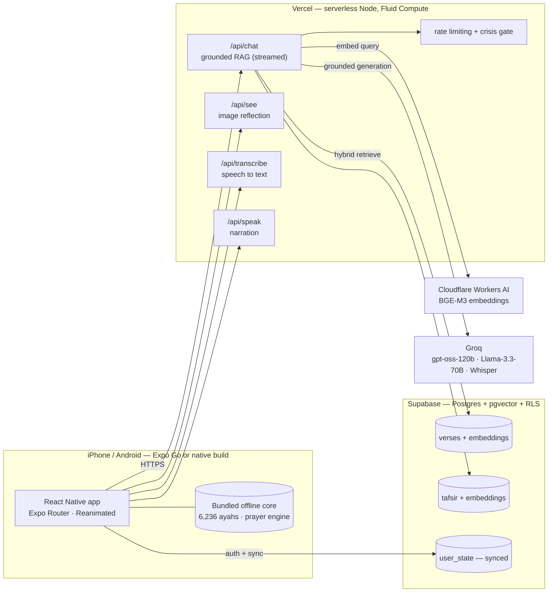
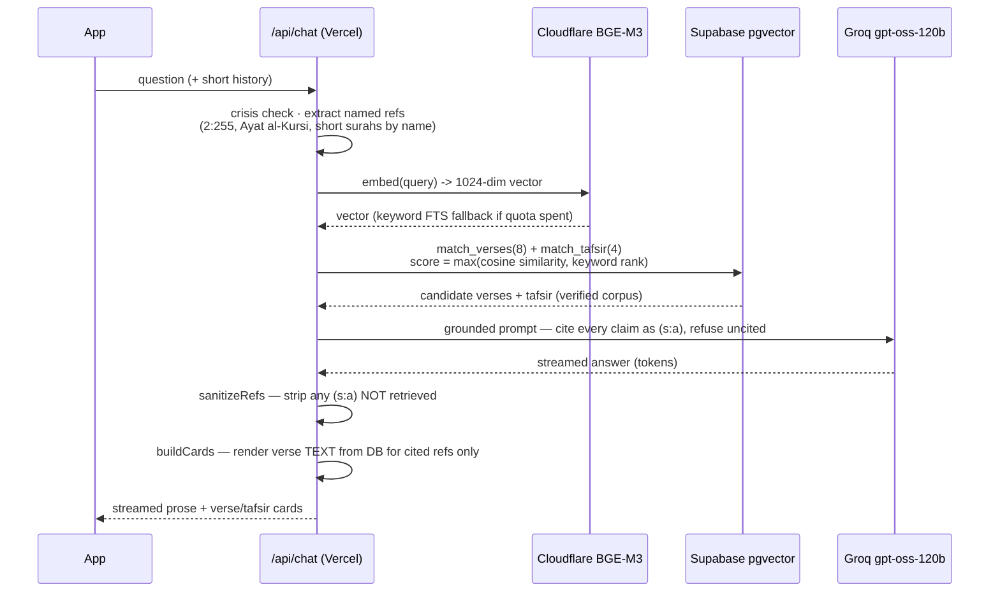
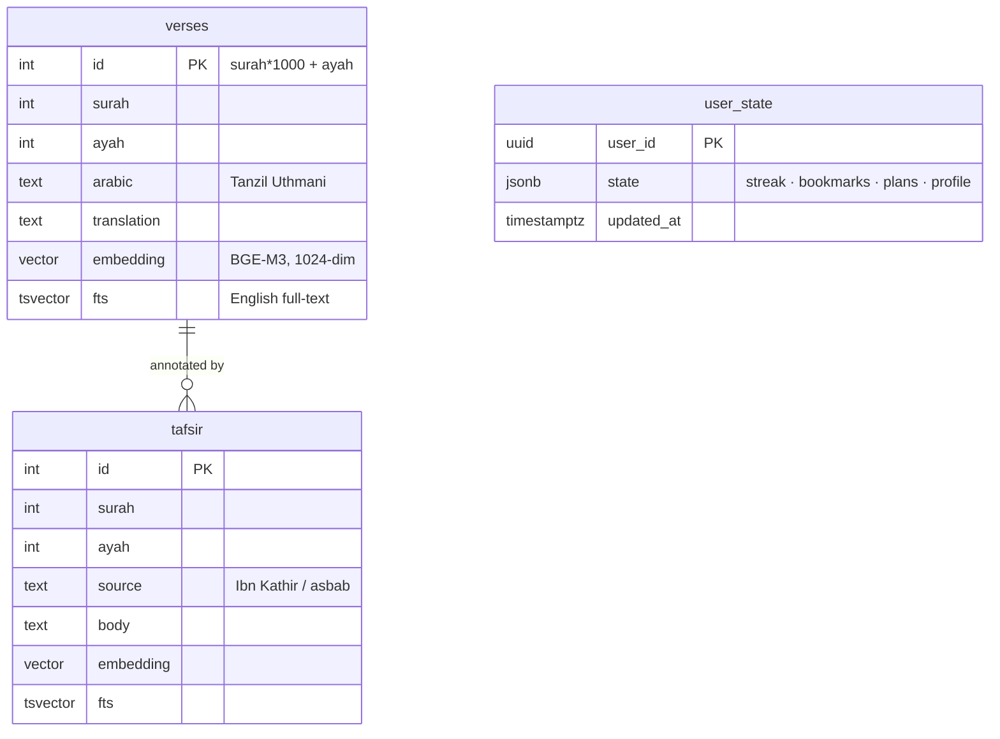

<p align="center">
  
</p>

<h1 align="center">Daily Qur'an</h1>

<p align="center">
  A privacy-first Qur'an study app — verified scripture, on-device prayer times, and a
  <em>grounded</em> AI study companion that cites real verses and <strong>never generates scripture</strong>.
</p>

<p align="center">
  <strong>React Native (Expo SDK 54)</strong> &nbsp;·&nbsp; <strong>TypeScript</strong> &nbsp;·&nbsp;
  <strong>Supabase + pgvector</strong> &nbsp;·&nbsp; <strong>Vercel</strong> &nbsp;·&nbsp;
  <strong>Retrieval-Augmented Generation</strong> &nbsp;·&nbsp; <strong>$0 infrastructure</strong>
</p>

---

## Run it in ~2 minutes

The app runs in **Expo Go** — no Xcode, no native build, no Apple Developer account.

**You need:** [Node.js](https://nodejs.org) **>= 20.19**, and the free **Expo Go** app on your phone
([iOS](https://apps.apple.com/app/expo-go/id982107779) · [Android](https://play.google.com/store/apps/details?id=host.exp.exponent)).

```bash
git clone https://github.com/MuhammadAhmed43/Daily-Quran.git
cd Daily-Quran/mobile
cp .env.example .env      # public client config (no secrets) so the app reaches the live backend
npm install
npx expo start
```

Then **scan the QR code** in the terminal with your phone's Camera (iOS) or the Expo Go app — the app
opens directly on your device.

- **On a Mac you do not even need a phone:** press **`i`** in the Expo terminal to open the iOS Simulator.
- If the QR will not connect (different network / firewall): run **`npx expo start --tunnel`**.
- It runs against the **live deployed backend** (Vercel + Supabase), so the grounded AI chat, voice,
  prayer times, reading, stories, and study plans all work immediately. Sign in with Google, or tap
  **"Continue as guest"** to jump straight in. No accounts or API keys required from you.

> Prefer a real native build? See **[Build a native app](#build-a-native-app-optional)** below
> (`npx expo run:ios` — free on a Mac).

---

## What it does

| Area | Capability |
|---|---|
| **Qur'an** | All 114 surahs, verified Uthmani script, selectable English translations (Itani · Pickthall · Yusuf Ali), RTL rendering, per-ayah audio recitation, whole-Qur'an listen mode, search by reference / fuzzy / voice. **Fully offline.** |
| **Grounded AI study chat** | Retrieval-augmented Q&A that answers from **cited** verses + classical tafsir, streamed token-by-token. **The model never emits scripture** — verse text is rendered from a verified database by ID. Voice conversation and photo reflection included. |
| **Prayer** | On-device prayer times ([adhan-js](https://github.com/batoulapps/adhan-js), Meeus astronomy), live next-prayer countdown, local adhan notifications, Qibla compass. Selectable calculation method + madhab. |
| **Stories & plans** | Fully **aniconic** prophet stories with neural narration, a personal Qur'an reading plan with pacing, guided journeys, a date-stable verse of the day, streaks, a quiz, and a community "Ameen" wall with cross-device account sync. |
| **Privacy** | Reading + prayer run entirely on-device. Only the AI layer is networked, and only through **no-training** model providers. Local-first storage; opt-in cloud sync. |

---

## System architecture

A thin, offline-capable client; a stateless serverless API that owns all AI orchestration and safety
gating; verified data in Postgres. No secret ever ships in the app.



**Design stance.** The client is deliberately "dumb" about safety — every faithfulness rule lives
server-side where it can be enforced in code and cannot be bypassed by a tampered client. The backend is
stateless and idempotent; all durable state is in Supabase (verified corpus + per-user sync blob).

---

## The grounded-AI (RAG) pipeline

The core engineering problem: **free-tier LLMs reproduce Qur'anic Arabic incorrectly the majority of the
time.** So the model is never trusted to produce scripture. It is used only to *reason over* and *cite*
verses that are retrieved from a verified corpus and rendered from the database by ID.



**Stage by stage:**

1. **Crisis gate (first, always).** A regex screens for self-harm / suicidal ideation; if matched, the
   app surfaces real help and support *before* any scripture. Wellbeing precedes verses.
2. **Named-reference guarantee.** Explicit references (`2:255`), "Ayat al-Kursi / Throne verse", and
   famous short surahs by name are extracted and fetched directly, so a user who asks for a specific
   verse always gets exactly that verse — similarity search alone would miss surahs referenced by nickname.
3. **Query embedding.** The question is embedded with **BGE-M3** (1024-dim, 8192-token) via Cloudflare
   Workers AI. Corpus and query vectors come from the *same* model — a mismatch silently degrades
   retrieval.
4. **Hybrid retrieval.** Two pgvector RPCs (`match_verses`, `match_tafsir`) score each candidate as
   `max(vector cosine similarity, keyword ts_rank)`, returning the top 8 verses + 4 tafsir passages.
   If the embedding quota is exhausted, the pipeline degrades gracefully to PostgREST full-text search.
5. **Grounded generation.** Groq `gpt-oss-120b` answers under a system prompt that requires every
   theological claim to carry an explicit verse ID and to refuse uncited assertions. The response
   streams token-by-token.
6. **`sanitizeRefs` — the prose gate.** Any parenthesized `(surah:ayah)` citation the model produced
   that was **not** in the retrieved set is stripped out, so the model cannot cite or recommend verses
   from memory.
7. **`buildCards` — the scripture gate.** Verse cards are rendered **from the database** for only the
   refs the answer actually cited; tafsir cards appear only when the answer leaned on Ibn Kathir. The
   model's text is never used as scripture — it is intersected against verified rows and re-rendered.

**Image reflection** (`/api/see`) and **voice** (`/api/transcribe` -> chat -> `/api/speak`) reuse the
same retrieval + gating core. Image OCR is resolved to an exact verse by **normalized-Arabic bigram
containment** (accept threshold >= 0.6), never by letting the model render the Arabic.

---

## Why it (almost) never gets scripture wrong

The faithfulness guarantee is **architectural, not probabilistic** — it does not depend on the model
behaving. Paired with an honest disclosure of where prototype limits remain.

| Mechanism | What it guarantees | Confidence |
|---|---|---|
| **Render scripture from DB by ID** | The LLM never emits verse bytes; Arabic + translation come from verified Tanzil rows. | High |
| **`sanitizeRefs` + `buildCards`** | Uncited / hallucinated references are stripped from prose and cards before they reach the user. | High |
| **Named-ref guarantee** | A requested verse is always the correct verse. | High |
| **Prompt-grounding + verse-ID citations** | Every claim is tied to a retrievable reference; uncited claims are refused. | Medium |
| **Crisis-first routing** | Distress is met with support resources before scripture. | High |
| **Tiered aniconism (server-side allowlist + curated, human-reviewed art)** | No depiction of any prophet, in any form; no on-the-fly generation of sacred scenes. | High |

**The numbers that justify the design** (sources + confidence in [`ARCHITECTURE.md`](ARCHITECTURE.md)):

| Metric | Value | Why it matters |
|---|---|---|
| Verse recognition, weak/mid free models (IslamicMMLU) | **26–41%** | 1-in-2 to 2-in-3 verses misidentified — generating scripture is unsafe. |
| Specialist Arabic-7B under RAG, correct verbatim ayahs | **65–82%** | Even purpose-built models miss 1-in-5 to 1-in-3 — still render from DB. |
| Frontier model at 1% error across 6,236 verses | **~62 misquotes** | "Good enough" generation still produces dozens of errors. |
| BGE-M3 retrieval (Arabic Quran-Tafseer) | **82.72** | Best free Arabic retrieval tested; multilingual beats Arabic-specific. |
| Zero-shot NLI as a faithfulness gate | **~100% FPR @ 95% recall** | Why NLI was rejected as the primary gate in favor of citation enforcement. |

**Honest scoping.** No zero-budget, zero-latency mechanism gives *production-grade* faithfulness on
classical Qur'anic theology. The citation-enforcement gates are strong and code-enforced; the
LLM-as-judge layer is an explicit *prototype*. Production would add a fine-tuned faithfulness model and
human scholarly review — a requirement reinforced by Egypt's Dar al-Ifta (Jan 2026) ruling on AI and
Qur'an interpretation. This honesty is the defensible position, and it is stated in the app's disclaimers.

---

## Data model



- **Corpus:** 6,236 verses (Hafs/Kufan numbering, locked end-to-end), ~25.5 MB of vectors, pre-embedded
  once offline with BGE-M3 — not at request time.
- **Retrieval** is exposed as Postgres RPCs (`match_verses`, `match_tafsir`) combining vector cosine
  similarity with keyword `ts_rank`.
- **`user_state`** is a single per-user JSON blob (streak, bookmarks, reading position, plans, profile),
  protected by Row-Level Security and merged client-side for conflict-free multi-device sync.

---

## Privacy, cost, and infrastructure

- **$0 infrastructure.** Supabase free tier (Postgres + pgvector + Auth + Storage + RLS), Vercel Hobby
  (serverless Node, Fluid Compute), Groq + Cloudflare Workers AI free tiers. Every quota is treated as a
  *measure-it-yourself* value with graceful 429 / degradation handling, not a guarantee.
- **No-training model providers only.** Groq and Cloudflare Workers AI do not train on user data —
  chosen specifically because spiritual questions are sensitive (Gemini's free tier trains on prompts
  with human review and no opt-out, and was rejected for user content).
- **Local-first.** Reading, prayer times, streaks, bookmarks, and plans live on-device; cloud sync is
  opt-in and RLS-scoped to the user.
- **The binding cost limit is Vercel Provisioned Memory** (360 GB-hrs/month ≈ ~72 long AI streams/day),
  not invocations — so AI endpoints are rate-limited at the edge.
- **Supabase keep-alive.** Free projects auto-pause after 7 days; an **external GitHub Actions cron**
  pings a real DB endpoint every few days (internal `pg_cron` cannot wake a paused database).

---

## Tech stack

| Layer | Choice |
|---|---|
| App | React Native, **Expo SDK 54**, Expo Router (typed routes), TypeScript, Reanimated, react-native-svg |
| State / storage | Local-first (AsyncStorage) + opt-in Supabase sync (RLS) |
| Backend | **Vercel** serverless (Node, Fluid Compute), stateless RAG + safety gating |
| Vector DB | **Supabase Postgres + pgvector**, hybrid vector + full-text retrieval |
| Embeddings | **BGE-M3** (1024-dim) via Cloudflare Workers AI |
| LLMs | **Groq** — `gpt-oss-120b` (chat), `llama-3.3-70b-versatile` (voice), `whisper-large-v3-turbo` (STT) |
| Prayer times | **adhan-js** (pure-JS, offline, Meeus astronomy) |
| Data | Tanzil Uthmani Arabic (CC BY 3.0) · public-domain translations · classical tafsir (graded context) |

---

## Offline core

The reading and worship experience requires **no network at all**:

- Full Qur'anic Arabic + translations bundled in the app.
- Prayer times, countdown, Qibla, and adhan **local notifications** computed on-device with adhan-js.
- Verse of the Day is **rotated deterministically by date** — never an LLM pick — so it is reproducible,
  offline, and free of out-of-context risk.
- Recitation audio streams from a CDN on demand (bundling one reciter would exceed Apple's cellular cap).

---

## Build a native app (optional)

You do not need this to review the app, but it builds to a real native binary (no custom native modules
beyond standard Expo / React-Native ones).

**On a Mac — free, no paid Apple account:**

```bash
cd mobile
npx expo run:ios             # iOS Simulator
npx expo run:ios --device    # ...or onto a plugged-in iPhone (sign with a free Apple ID, 7-day)
```

`expo run:ios` auto-generates the native `ios/` project (`expo prebuild`) and builds it with Xcode. For
the `--device` path, if Xcode asks about signing, open `mobile/ios` in Xcode once and set
**Signing & Capabilities -> Team -> your (free) Apple ID**, then re-run. Android (any OS):
`npx expo run:android`. The repo also ships a GitHub Actions workflow
([`.github/workflows/ios-unsigned.yml`](.github/workflows/ios-unsigned.yml)) that builds an unsigned
`.ipa` for sideloading without a Mac — that was for the author's Windows setup.

---

## Project structure

```
.
├── mobile/                 React Native app (Expo)
│   ├── app/                screens + routes (Expo Router): tabs, surah reader, chat, voice, stories, plans
│   ├── components/         UI kit, splash, cosmic/sky visuals, players
│   ├── lib/                domain logic: recitation, sync, prayer-times, quran-plan, chat client, theme
│   └── assets/             bundled Qur'an JSON, fonts, story art + narration, icons
├── api/                    Vercel serverless functions
│   ├── chat.js             grounded RAG chat (retrieve -> ground -> sanitize -> render)
│   ├── _rag.js             shared retrieval + faithfulness gates + verse recognition
│   ├── see.js              image reflection (OCR -> recognize verse -> grounded reply)
│   ├── transcribe.js       speech-to-text (Whisper)
│   ├── speak.js            narration / TTS
│   ├── explain.js          single-verse explanation
│   ├── ameen-*.js          community "Ameen" wall
│   ├── keepalive.js        Supabase anti-pause cron target
│   └── _ratelimit.js       edge rate limiting
├── ARCHITECTURE.md         the full, fact-checked decision log (read this)
└── README.md
```

---

## Architecture decision log

The complete engineering rationale — every "why X not Y", the metrics with sources and confidence
levels, the faithfulness strategy, model/provider selection, the aniconism policy, free-tier realities,
and an adversarial red-team of the design — lives in **[ARCHITECTURE.md](ARCHITECTURE.md)**. It is the
single best document for understanding the depth behind this project.

---

## Acknowledgements & data sources

- **Qur'anic Arabic text** — the [Tanzil Project](https://tanzil.net) Uthmani text, used under
  **CC BY 3.0** (attribution + a live link to tanzil.net are retained in-app).
- **English translations** — Marmaduke Pickthall (1930, public domain) and other selectable translations
  under their respective terms.
- **Tafsir / commentary** — classical sources (e.g. Ibn Kathir), presented as graded study context, never
  as fatwa.
- **Prayer-time calculations** — [adhan-js](https://github.com/batoulapps/adhan-js) (MIT).
- Open-source libraries are used under their respective licenses.

---

## License

**Copyright (c) 2026 Muhammad Ahmed. All rights reserved.**

This project is **proprietary** and is made publicly viewable for reference only. **No license is
granted** to use, copy, modify, distribute, sublicense, sell, reproduce, reverse-engineer, or create
derivative works of this software or its content, in whole or in part, without the **prior written
permission** of the copyright holder. Third-party data and libraries retain their own licenses as noted
above.

See **[LICENSE](LICENSE)** for the full terms.
